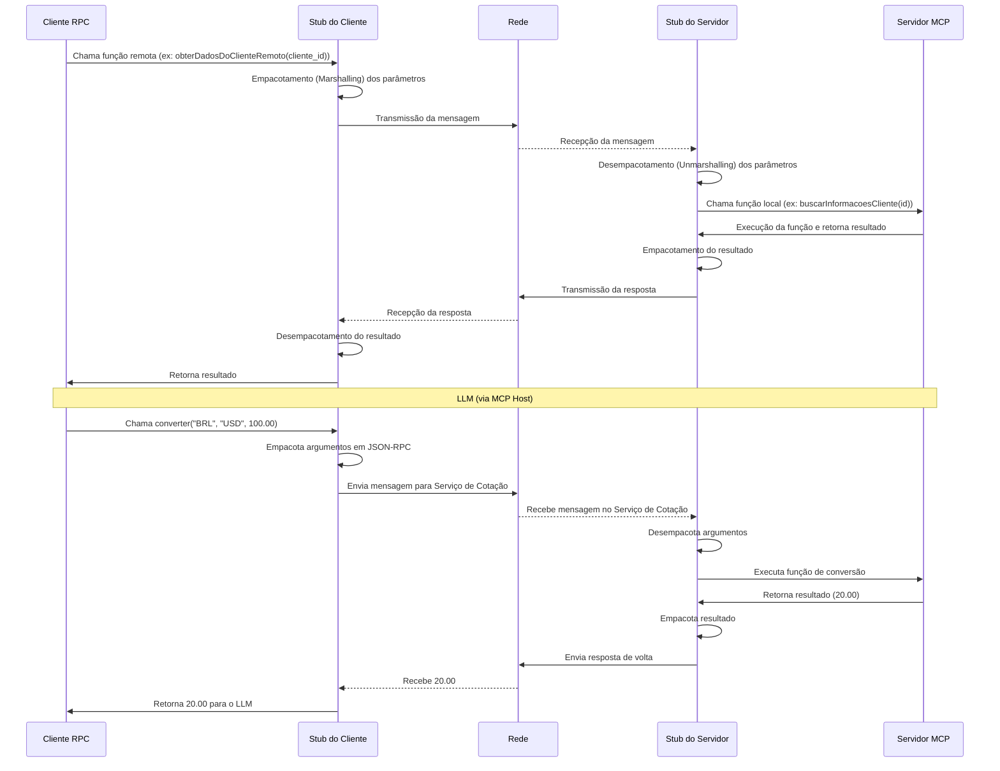
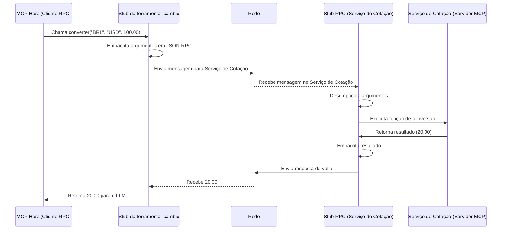

# Por Debaixo dos Panos: Protocolo MCP Além do Hype

Olá, comunidade!

Hoje vamos mergulhar em um tema que está ganhando cada vez mais destaque no universo da Inteligência Artificial: o **Model Context Protocol (MCP)**. Mas, mais do que apenas surfar na onda do hype, queremos entender o que realmente está acontecendo "por debaixo dos panos". Como essa tecnologia funciona? Quais são os mecanismos que permitem que modelos de linguagem (LLMs) interajam de forma tão fluida com o mundo exterior? E, crucialmente, quais são as implicações de segurança que precisamos considerar?

## O que é o Model Context Protocol (MCP)?

Em essência, o Model Context Protocol (MCP) é um protocolo aberto e padronizado, muitas vezes associado a iniciativas como as da Anthropic. Ele foi projetado para facilitar a integração de Modelos de Linguagem Grandes (LLMs) com uma vasta gama de fontes de dados e ferramentas externas. Pense nele como uma ponte universal que permite que assistentes de IA acessem, compreendam e interajam com dados em tempo real – sejam eles de bancos de dados, APIs, arquivos locais ou outras ferramentas – de forma segura e eficiente, eliminando a necessidade de integrações personalizadas para cada sistema.

O objetivo é simples, mas poderoso: capacitar a IA com o contexto necessário para executar tarefas com maior precisão e relevância.

## A Mágica por Trás da Cortina: Chamada de Procedimento Remoto (RPC)

Para que o MCP realize sua mágica de conectar o LLM a sistemas externos, ele frequentemente se apoia em um conceito fundamental da computação distribuída: a **Chamada de Procedimento Remoto (RPC)**.

### Explicando a Chamada de Procedimento Remoto (RPC)

Basicamente, RPC é uma técnica que permite que um programa em um computador execute código (um procedimento ou função) em *outro computador* (ou em um processo diferente no mesmo computador) como se esse código estivesse sendo executado localmente. A "mágica" do RPC é esconder toda a complexidade da comunicação de rede do desenvolvedor.

Imagine dois programas:
1.  **Cliente:** O programa que quer executar uma função (no nosso caso, pode ser o sistema que gerencia o LLM ou o próprio LLM através de uma camada de abstração).
2.  **Servidor:** O programa que possui a função e a executa (no contexto do MCP, seria um "servidor MCP" expondo uma ferramenta ou fonte de dados).

O RPC faz com que o Cliente possa chamar uma função no Servidor de forma transparente. Para o desenvolvedor do Cliente, parece uma chamada de função normal.

### Como funciona o RPC (de forma simplificada)?

1.  **O Cliente chama uma função "stub" (de esboço/representante):** No lado do cliente, há um pedaço de código chamado "stub do cliente". Quando o programa cliente chama a função remota (ex: `obterDadosDoClienteRemoto(cliente_id)`), ele na verdade está chamando uma função nesse stub do cliente.
2.  **Empacotamento (Marshalling):** O stub do cliente pega os parâmetros da função (`cliente_id`) e informações sobre qual função executar, e os "empacota" em uma mensagem padronizada (ex: JSON, Protocol Buffers). Esse processo é chamado de *marshalling*.
3.  **Transmissão pela Rede:** O stub do cliente envia essa mensagem pela rede para o servidor MCP.
4.  **Recepção e Desempacotamento (Unmarshalling) no Servidor:** No lado do servidor MCP, há um "stub do servidor". Ele recebe a mensagem da rede e a "desempacota", extraindo os parâmetros e identificando qual função local deve ser chamada. Esse é o *unmarshalling*.
5.  **Execução no Servidor:** O stub do servidor chama a função real no programa servidor MCP com os parâmetros recebidos (ex: a função `buscarInformacoesCliente(id)` no servidor MCP é chamada com o `id` correspondente).
6.  **Resultado e Empacotamento no Servidor:** A função no servidor MCP executa e retorna um resultado (ex: os dados do cliente). O stub do servidor pega esse resultado e o empacota em uma mensagem de resposta.
7.  **Transmissão da Resposta pela Rede:** O stub do servidor envia a mensagem de resposta de volta para o cliente.
8.  **Recepção e Desempacotamento no Cliente:** O stub do cliente recebe a resposta, desempacota o resultado.
9.  **Retorno ao Cliente:** O stub do cliente retorna o resultado final para o programa cliente, como se a função tivesse sido executada localmente.

### Benefícios do RPC no Contexto do MCP:

* **Abstração:** O desenvolvedor que integra o LLM não precisa se preocupar com os detalhes da comunicação de rede com cada ferramenta ou fonte de dados.
* **Desenvolvimento Distribuído:** Facilita a criação de um ecossistema de "ferramentas MCP" que podem ser desenvolvidas, implantadas e escaladas independentemente.
* **Interoperabilidade:** Com um protocolo bem definido, diferentes sistemas podem se comunicar de forma padronizada.

### Exemplo Prático de RPC: Um Serviço de Cotação de Moedas como Ferramenta MCP

Imagine que um LLM precisa fornecer uma resposta que envolve a cotação atual de moedas.

* **LLM (via "MCP Host" - Cliente RPC):** Precisa converter R$ 100,00 para Dólar. Ele faz uma chamada que parece local: `valor_em_dolar = ferramenta_cambio.converter("BRL", "USD", 100.00)`.
* **Serviço de Cotação (Servidor MCP - Servidor RPC):** Um microsserviço que expõe a funcionalidade de conversão.

**O que acontece "por debaixo dos panos" (RPC):**

1.  O "MCP Host" (atuando como cliente RPC) chama a função `converter` no stub da `ferramenta_cambio`.
2.  O stub empacota os argumentos ("BRL", "USD", 100.00) em uma mensagem JSON-RPC (um formato comum para RPC sobre HTTP).
3.  A mensagem é enviada pela rede para o Serviço de Cotação.
4.  O Serviço de Cotação recebe a mensagem, e seu stub RPC a desempacota.
5.  A função de conversão real é executada no Serviço de Cotação.
6.  O resultado (ex: `20.00`, supondo 1 USD = 5 BRL) é empacotado e enviado de volta.
7.  O stub no "MCP Host" recebe `20.00` e o retorna para o fluxo do LLM.

O LLM obteve a informação necessária sem precisar saber como o Serviço de Cotação funciona internamente ou como se comunicar diretamente com ele em baixo nível. Tecnologias como gRPC, Apache Thrift, e o próprio JSON-RPC são exemplos de implementações RPC que podem ser usadas aqui.

## 📞 Contato

Se você tiver dúvidas, sugestões ou precisar de suporte sobre nossa plataforma, entre em contato com:

* **Nome do Responsável/Time:** Roberto Timóteo Vieira da Silva (Betinho) - Fundador CoAgentis
* **Email:** betinhoorl@gmail.com
* **Canal de Comunicação (Linkedin):** [\[Roberto Timóteo da Silva\]](https://www.linkedin.com/in/roberto-tim%C3%B3teo-da-silva-67080aaa/)

---

Feito com ❤️ pela equipe CoAgentis